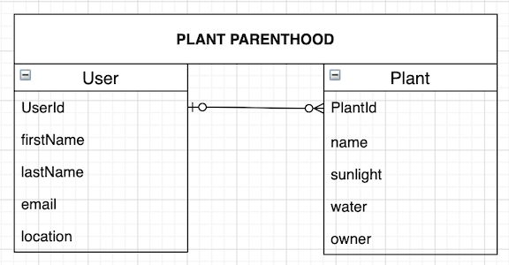
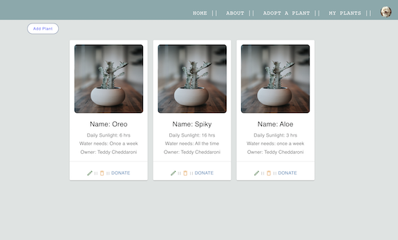
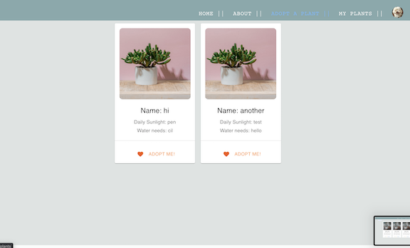

# Plant Parenthood :cactus:
Check it out <a href="https://plantslove.herokuapp.com/">here!</a> 

To sign up, please ensure you include "@" and "." in your email, and use "Hello!@34" as your password. 

Or you can use this test account to log in: 
* Email: test@123.com
* Password: Hello!@34 

### Intro
  Houseplants are awesome!! They are decorative, require little attention, and can even help purify the air around you. But what happens when you have to make a sudden move and can’t bring all your plants with you? Or when you downsize? Or if you just want to switch it up with different types of plants? 

  ***Plant Parenthood*** is the place for that! Donate or trade your plant babies here! 
*I can’t take credit for this pun. If anyone knows the original source, please let me know!*

### User Story

* Upon landing on the home page, a user can sign up with his/her name and email address. 
* User can use his/her credentials to log in.
* Once logged in, user can:
  * View/Edit/Delete profile (CRUD on user)
  * Create/Edit/Delete his/her plant(s) (CRUD on plant)
  * Donate a plant
  * View a listing of all other plants available for trade from other users

### MVP

  **Backend** 

    1. Plant database
    2. Error handling

  **Frontend**

    1. Home, About, User Profile, and Plant index, Login, and Signup pages with validation
    2. Responsive design

  **Fullstack**
  
    1. User auth
    2. CRUD on User and Plant models

### Future features
  * Include a functional search bar.
  * Execute trades with other users.
  * Once a trade request has been made, the other plant owner would get a message alert to either decline or accept the trade. 
  * Expand the categories to include flowers, vegetables, plant pottery or other planting equipment.

### Technologies used
 * MERN (Mongo DB, Express, JS, React, Node JS)
 * Material UI
 * HTML, CSS

### ERD Model 

 
 
### Wireframes

 

 

 

 

 

 

 